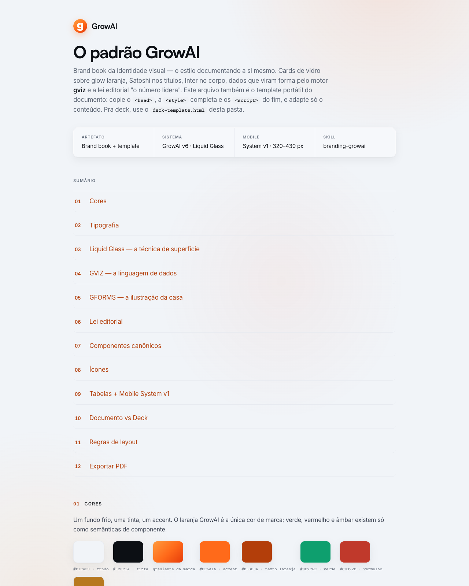
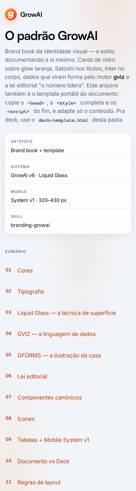

# branding-growai

**A identidade visual GrowAI como skill drop-in pra Claude Code.** Documentos, decks, PDFs, one-pagers e dashboards no padrão **GrowAI v6 "Liquid Glass"**: Satoshi + Inter, fundo frio `#F1F4F8`, laranja `#FF6A1A`, cards de vidro sobre glow, **motor de gráficos GVIZ**, **motor de formas conceituais GFORMS** e a lei editorial **"o número lidera"**. Mobile garantido de 320 a 430 px.

| Desktop | Mobile (390 px) |
|---|---|
|  |  |

## O que vem dentro

- **[`SKILL.md`](SKILL.md)** — a spec travada: paleta, tipografia, lockup, Liquid Glass em 4 camadas, os motores GVIZ e GFORMS, regra de diagramas, spec de ícones, a lei editorial, os dois formatos (documento e deck), componentes canônicos, Mobile System v1, export de PDF via Playwright e gotchas.
- **[`brand-book.html`](brand-book.html)** — o estilo documentando a si mesmo em 12 seções, com os 7 gráficos, as 6 formas e os ícones rodando ao vivo. Também é o **template portátil do documento**: copie o `<head>`, a `<style>` completa e os `<script>` do fim.
- **[`deck-template.html`](deck-template.html)** — esqueleto pronto de **deck** (100vh + scroll-snap, beats escuros com glow, gráfico como herói do slide, print-ready).
- **[`gviz.js`](gviz.js)** — o motor de dados: `bars`, `hbars`, `ring`, `funnel`, `share`, `line` e `flow` (diagrama de etapas com conectores no mesmo SVG) em SVG puro, zero dependências. Um destaque laranja por gráfico, números em Satoshi, série neutra em cinza frio, `dark:true` pros slides escuros. Vetorial no PDF de graça.
- **[`gforms.js`](gforms.js)** — o motor de formas conceituais (a "ilustração da casa"): `orbe`, `aneis`, `horizonte`, `campo`, `seta`, `onda` — pontos e gradiente da marca, determinísticos, um foco por forma. Quando o slide precisa de conceito em vez de dado, a forma sai daqui, nunca de banco de imagem.

## Instalação

Skill global (vale pra qualquer projeto):

```bash
git clone https://github.com/rafaelnasch/branding-growai.git ~/.claude/skills/branding-growai
```

Ou por projeto:

```bash
git clone https://github.com/rafaelnasch/branding-growai.git .claude/skills/branding-growai
```

## Uso

No Claude Code, peça qualquer material citando o estilo:

- `/branding-growai` · "faz no padrão growai" · "deck growai" · "gráfico growai"
- "gera um one-pager dessa proposta no padrão growai"
- "transforma esse relatório de vendas em deck com a identidade growai"

A skill instrui o Claude a abrir o brand book primeiro e construir o material com os tokens, o motor de gráficos, a lei editorial e os gates do padrão (teste mobile 320–430 px e PDF via Playwright inclusos).

## O padrão em 30 segundos

- **Cores:** fundo frio `#F1F4F8`, tinta `#0C0F14`, um único accent laranja `#FF6A1A` (gradiente da marca `#FF9A3D → #FF6A1A → #E63C0A`). Séries de gráfico em cinza frio; só O destaque fica laranja. Azul e violeta são banidos.
- **Tipografia:** Satoshi (display, 600/700, tracking negativo, todo número de gráfico) + Inter (corpo e rótulos) + mono pra VOC e código. Overlines em caps são a assinatura.
- **Liquid Glass:** glow laranja ambiente → cards `rgba(255,255,255,.66)` com `backdrop-filter: blur(20px)` → glow de destaque no winner → movimento discreto com fallbacks travados.
- **GVIZ + GFORMS:** dado com mensagem vira gráfico, não tabela (7 gráficos, incluindo diagrama de fluxo); conceito vira forma de pontos e gradiente (6 formas). Um destaque por visual, zero gridlines, ícones Lucide inline no lugar de emoji.
- **Lei editorial:** o número lidera; documento = 1 visual + ≤2 parágrafos por seção; deck = título ≤6 palavras + 1 linha de apoio; uma ideia por unidade.
- **Dois formatos:** vai ser lido → documento; vai ser apresentado → deck (mesmos tokens, beats escuros pro achado central).

## Adaptando pra sua marca

O CC BY 4.0 cobre o texto, o código e a documentação do design system — não o nome nem o logo GrowAI. Se for adaptar pro seu contexto, troque o lockup, o wordmark e os tokens de cor pelos da sua marca (o `SKILL.md` mostra exatamente onde cada um vive; o `gviz.js` concentra o gradiente em um único lugar).

## Licença

[CC BY 4.0](LICENSE). Anatomia da skill (spec travada + brand book auto-documentado + motor visual próprio + lei editorial) modelada na skill "Robo Style — a drop-in design skill for Claude Code" (CC BY 4.0); o design system GrowAI v6 "Liquid Glass" e o motor GVIZ são trabalho original da GrowAI.
